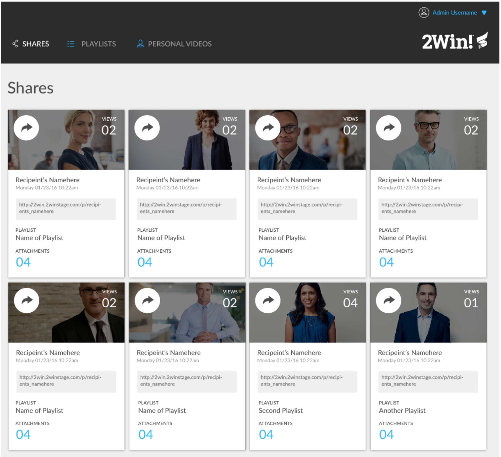
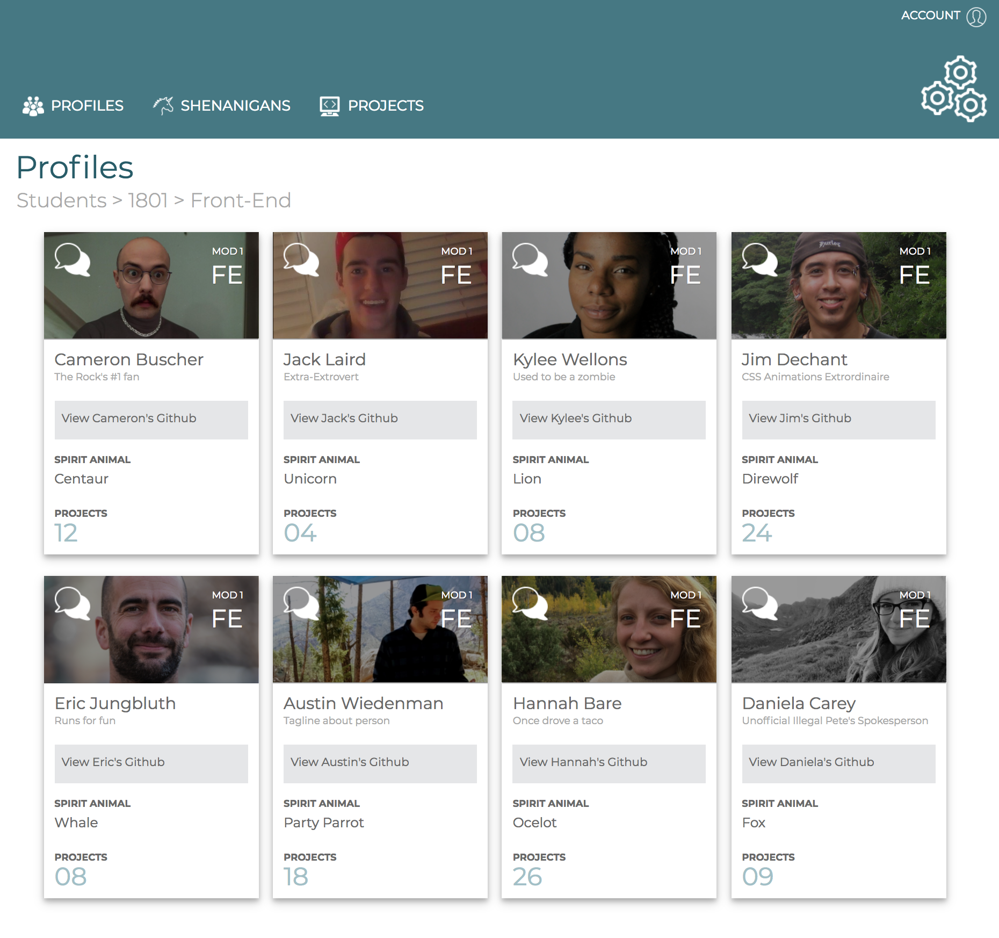
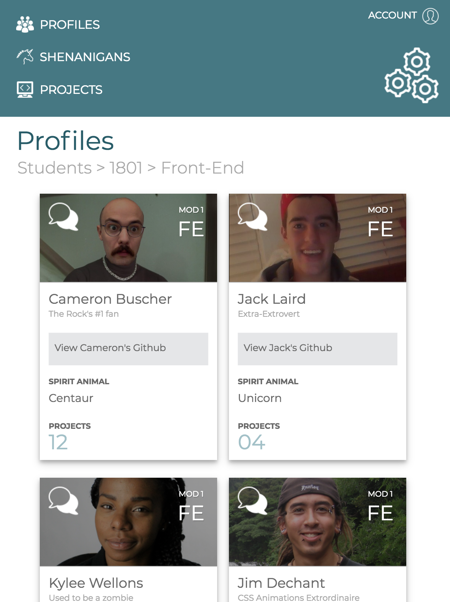
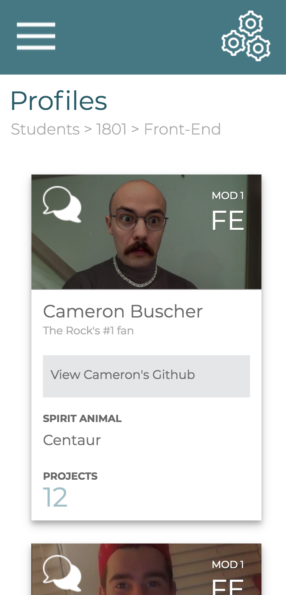

# Turing Faces (Turing Static Comp Challenge #2)

## Synopsis
[Turing Faces](https://danielafcarey.github.io/ds-comp-challenge-2/) is a static design for an internal student database tool. The layout was recreated based on the project specs (see Inspiration below) and the product concept was inspired by me wanting a resource for getting to know my classmates. 

### Inspiration
**Turing School of Software & Design Front-End Engineering Project - Mod 1:** Recreate the [given static comp](http://frontend.turing.io/projects/m1-static-comp-2.html). Creative liscense given on copy, images, icons, color palette. Site must be responsive and be hosted on Github pages. 

## Comp

## Project Screenshots
### Desktop:

### Tablet:

### Mobile:

